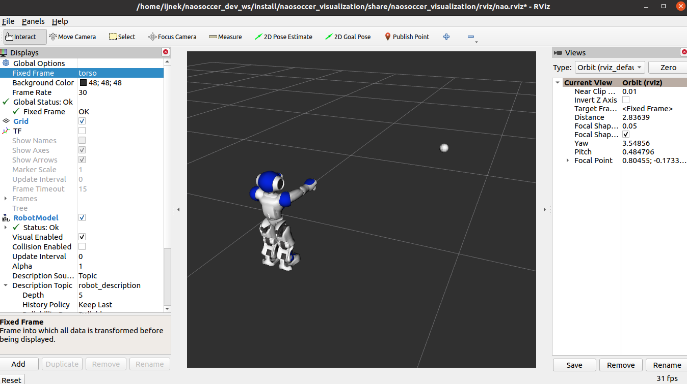

.. Nao Soccer Visualization documentation master file, created by
   sphinx-quickstart on Sat May 15 15:34:53 2021.
   You can adapt this file completely to your liking, but it should at least
   contain the root `toctree` directive.

Nao Soccer Visualization
========================

This package is used to visualize ROS2 topics related to nao soccer,
in RViz.

The project is hosted on `Github`_.

.. toctree::
   :hidden:
   :maxdepth: 2

   installation
   visualize-nao-in-rviz
   visualize-topics
   visualize-eye-leds
   related-ros2-packages

.. _Github: https://github.com/ijnek/naosoccer_visualization