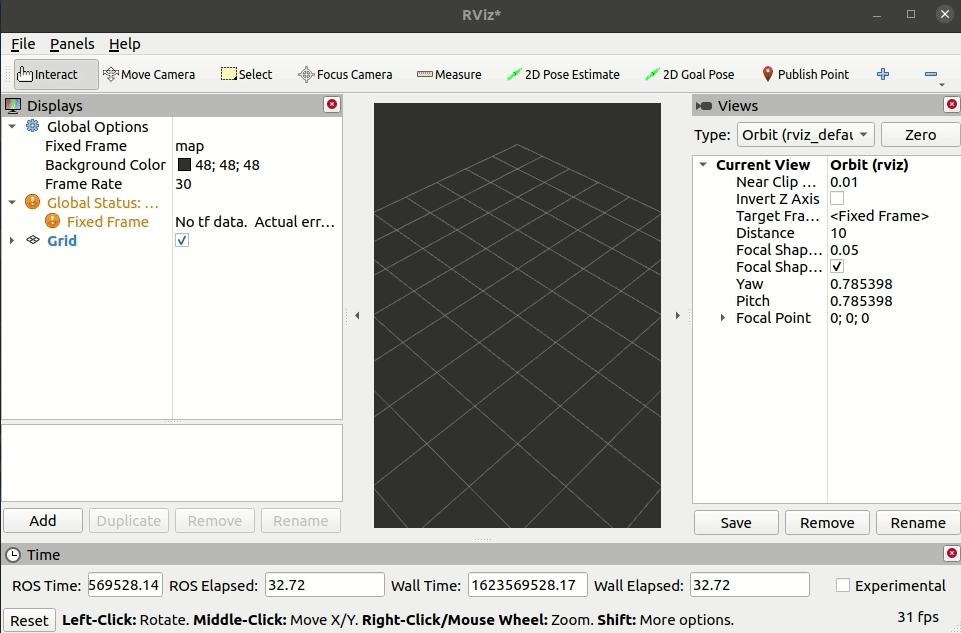
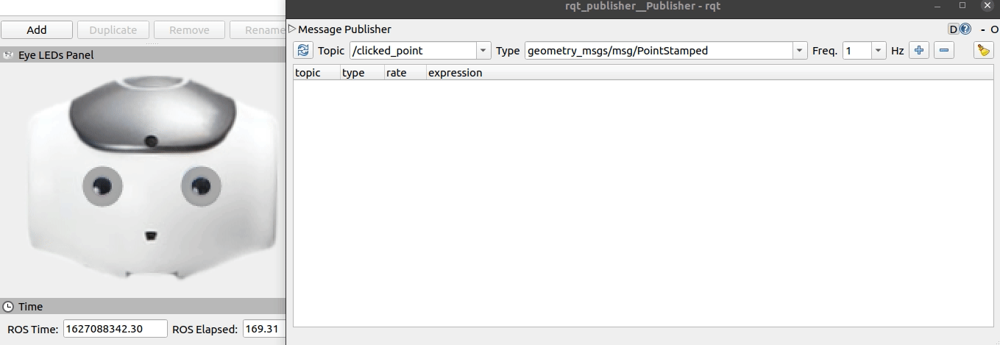

Visualizing eye leds in RViz
############################

Opening Eye LEDs Panel in RViz
******************************

.. note::

  Instructions here assume you have installed and sourced the packages for this project.

In a new terminal, open rviz2:

.. code-block:: console
  
  rviz2
  
From the menu bar, select **Panels > Add New Panel**
Select **Eye LEDs Panel**, under **naosoccer_rviz_plugins**.
You should see the plugin show up.

.. tip::

  If you don't see the plugin show up in the list, you probably forgot to run
  `. install/local_setup.sh` in your workspace after building the packages.

Visualizing LED Commands
************************

In a new terminal, open rqt's publisher plugin:

.. code-block:: console

  rqt -s rqt_publisher.publisher.Publisher

From **topic**, select **/effectors/eye_leds** and click the **+ button** to add a publisher.

Modify the r, g, b values between 0.0 and 1.0, for each LED. You should see the LEDs change color in rviz.

.. note::

  See `nao_interfaces/msg/EyeLeds`_ for more details, such as the indexes for the leds.

.. _nao_interfaces/msg/EyeLeds: https://nao-interfaces-docs.readthedocs.io/en/latest/msgs.html#eyeleds