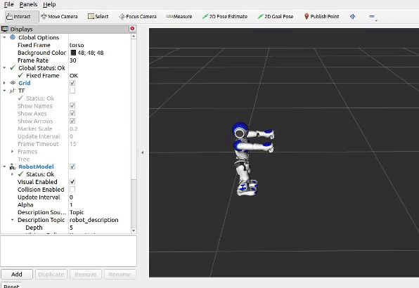
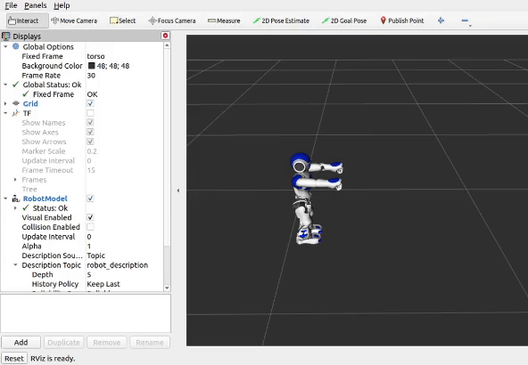

Visualizing different topics
############################

.. note::

    Instructions here assume that you have just completed :ref:`visualize_nao`, and have RViz open with the Nao showing correctly.

Visualize TF
************

TF Visualization is disabled by default, but can be enabled from the Displays Panel.

Visualize ball
**************

Ball Visuzalization is enabled by default.

